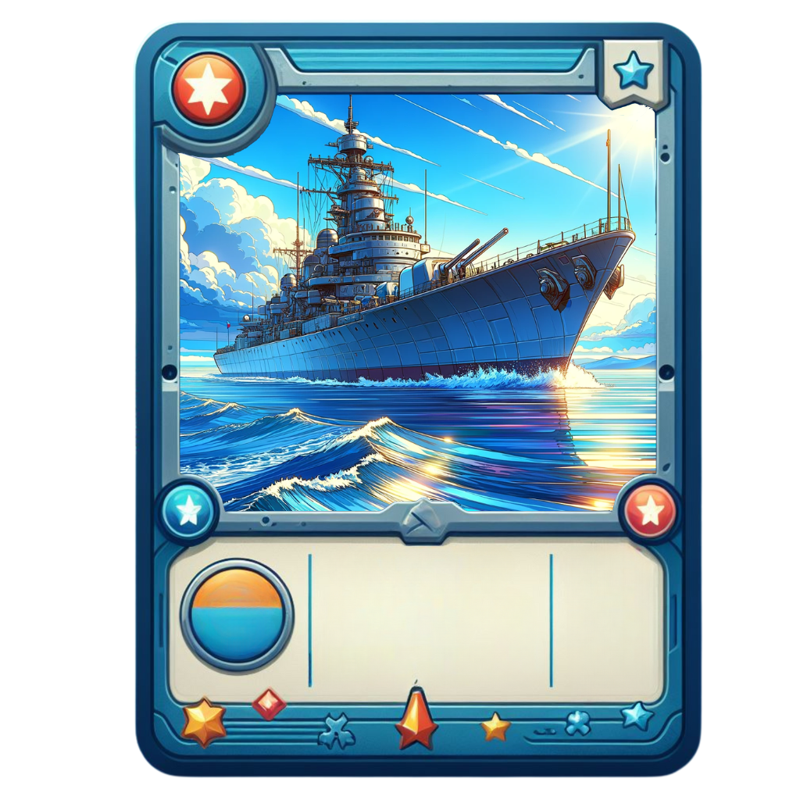
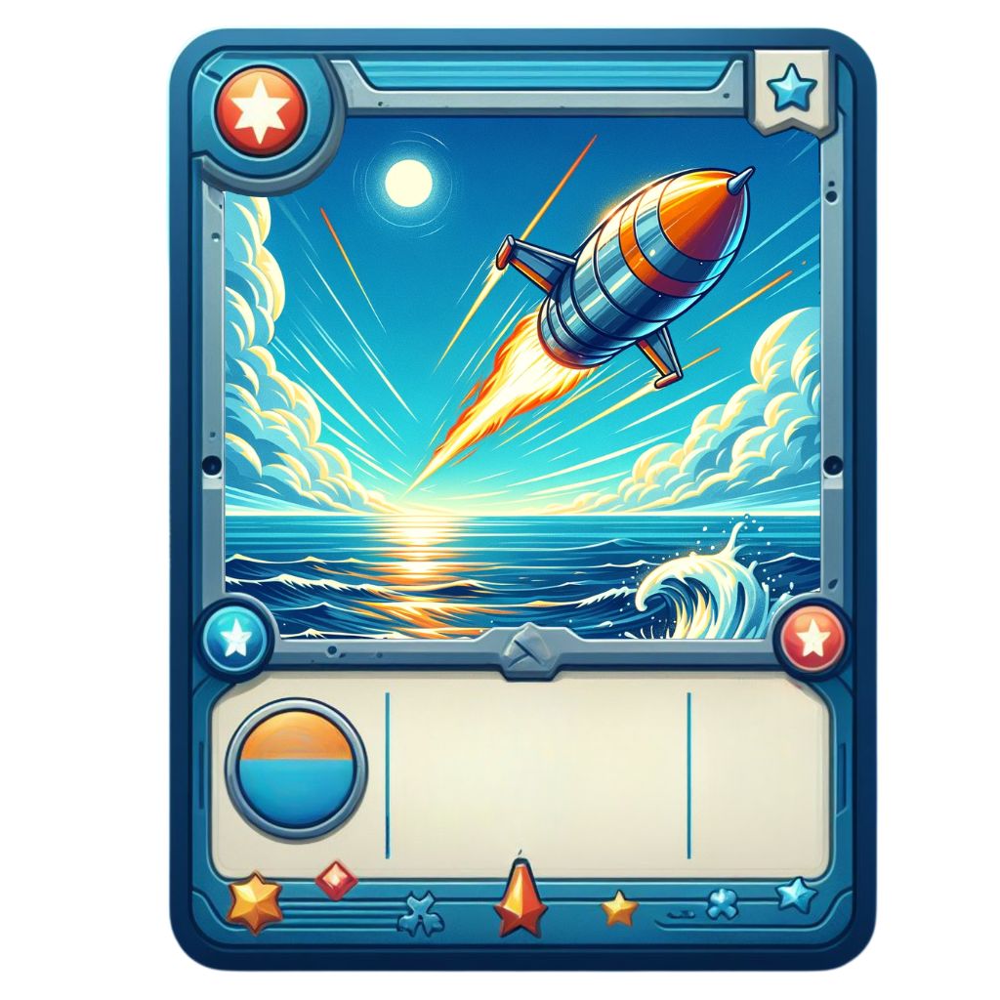
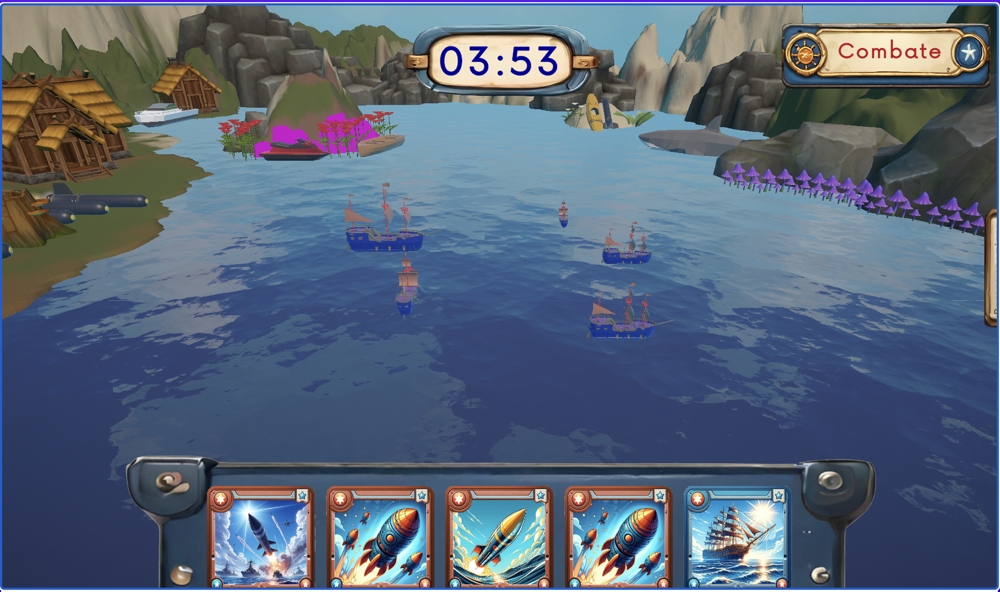
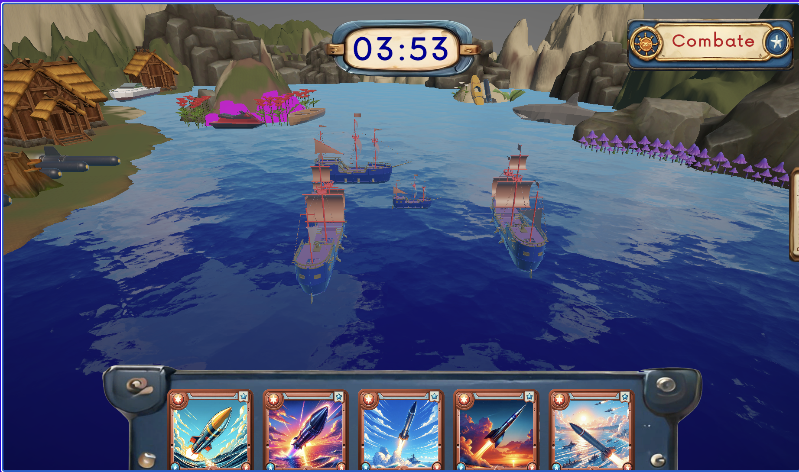
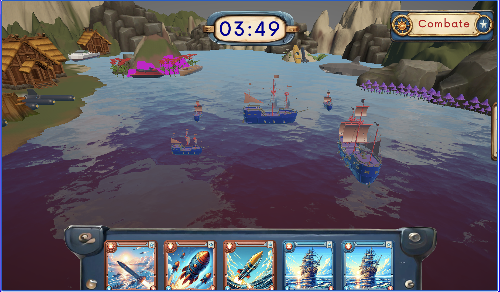
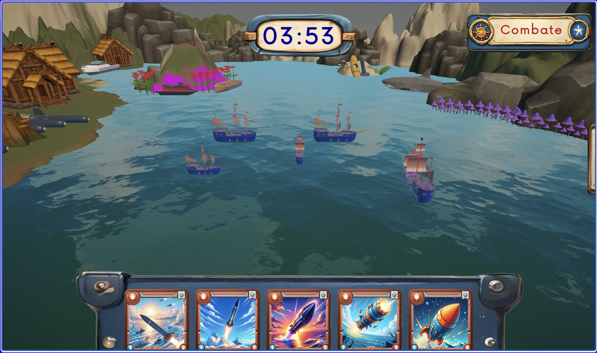

# **Ship Invasion**

## _Game Design Document_

---

##### Autores: Emily Rosenfeld, A01198339 / Marcos Dayan, A01782876/ Remy Patgher, A01784177

Equipo: REM Cycle

##

## _Índice_

1. [Índice](#índice)
2. [Diseño de Videojuego](#diseño-de-videojuego)
   1. [Resumen](#resumen)
3. [Índice](#índice)
4. [Diseño de Videojuego](#diseño-de-videojuego)
   1. [Resumen](#resumen)
   2. [Gameplay](#gameplay)
   3. [Mindset](#mindset)
5. [Técnico](#técnico)
   1. [Pantallas](#pantallas)
   2. [Controles](#controles)
   3. [Mecánicas](#mecánicas)
      1. [Cartas Ataque](#cartas-ataque)
      2. [Cartas Defensa](#cartas-defensa)
      3. [Mecánicas de Partida](#mecánicas-de-partida)
6. [Diseño de Nivel](#diseño-de-nivel)
   1. [Ambientación](#ambientación)
      1. [Mar Abierto](#mar-abierto)
      2. [Tormenta Eléctrica](#tormenta-eléctrica)
      3. [Río de Fuego](#río-de-fuego)
      4. [Pantano Tóxico](#pantano-tóxico)
7. [Hilo del Juego](#hilo-del-juego)
8. [Desarrollo](#desarrollo)
   1. [Clases](#clases)
9. [Gráficas](#gráficas)
   1. [Atributos de Estilo](#atributos-de-estilo)
   2. [Gráficas y Diseño](#gráficas-y-diseño)
10. [Sonido / Música](#sonido/música)
    1. [Atributos de Estilo](#atributos-de-estilo)
    2. [Sonido](#sonido)
    3. [Música](#música)
11. [Agenda](#agenda)

## _Diseño de Videojuego_

### **Resumen**

Ship Invasion es un videojuego de cartas TCG, en el que se juega en modo 1vs1 PvE local, y el objetivo principal es preservar la mayor parte de una flota naval dada, que será sometida a constantes ataques por turnos de diferentes proyectiles y misiles representados por cartas, que tanto el jugador como el contrincante, estarán usando constantemente para destruir la flota del competidor.

Hay dos principales tipos de cartas, las cartas de ataque, las cuales sirven para escoger cierta coordenada y lanzar un devastador ataque sobre ella, y las cartas de defensa, las cuales consisten en diferentes barcos de diferentes tamaños que serán incorporados en la flota. Dentro de todas las cartas, existen diferentes calidades de cartas, Bronze, Silver y Gold, en donde una carta de ataque de mejor calidad, va a atacar una cantidad mayor de casillas, y una carta de defensa de mejor calidad, va a poner una embarcación de mayor tamaño en la flota.

### **Gameplay**

Una partida consta de 2 etapas. La etapa del despliegue, y la etapa de destrucción.

La partida inicia con la etapa de despliegue. Una pantalla del territorio de la flota, este está representado con un grid, en el que se acomodarán 5 cartas de flota que serán repartidas aleatoriamente al jugador. Pasado ese lapso, se iniciará la fase de destrucción con el turno del jugador.

En la etapa de la destrucción, se reparten 5 cartas a cada jugador de manera aleatoria. Durante ésta etapa, se dará un lapso de 3 minutos en donde cada jugador en cada turno escoja una carta para jugar. Acá es donde entra la estrategia, se debe escoger entre realizar un ataque con las cartas disponibles, o defender una posición poniendo un barco, para aumentar el tamaño de la flota.

¿Quién gana? Gana el jugador que destruya la embarcación del otro antes de que se acabe el tiempo, o en caso de que se acabe el tiempo, el jugador que tenga más unidades de embarcación desplegadas. En caso de que tengan la misma cantidad de unidades de embarcación, gana el jugador quien haya hecho más daño al otro, y en el final de los casos, se tiene un empate.

### **Mindset**

Para jugar este juego, se requiere de una estrategia de juego que se irá perfeccionando a medida que el jugador obtenga mayor experiencia, el jugador tiene que estar constantemente concentrado para jugar con la mejor estrategia y escoger la carta indicada dependiendo de lo que haya jugado el oponente, por lo tanto el jugador se sentirá poderoso al ganar, y ansioso de jugar mejor y modificar su estrategia cuando pierda.

Al ver como el juego no tiene un patron exacto y hay un sentido de progresión (será explicado en sección de mecánicas), el jugador siempre se mantendrá interesado y con ganas de seguir jugando.

## _Técnico_

---

### **Pantallas**

1. Pantalla de Autenticación
   1. Registro
   2. Log In
2. Pantalla de título
   1. Entrar a menó de selección de aremas
   2. Pantalla de visualización de cartas
   3. Créditos
3. Menú
   1. Selección de diferentes arenas
4. Juego
   1. Tablero del Jugador con tablero del enemigo cerrado y cartas, en el que suceden todas las fases de la batalla
5. Resultados de partida
   1. Pantalla de resultados, en donde se anuncia el Ganador/Perdedor

### **Controles**

El jugador va a poder interactuar con el juego principalmente con el cursor del ratón y con el click izquierdo, seleccionando las diferentes cartas y ejecutando las acciones a través del cursor.

### **Mecánicas**

En Ship Invasion, hay dos tipos de cartas

1. Cartas de Ataque: Estas cartas se utilizan para lanzar ataques en coordenadas específicas y patrones en el tablero enemigo, intentando golpear y hundir las flotas navales del oponente. Hay 3 tipos de cartas, las Bronze, las Silver y las Gold, previamente descritas, entre mayor calidad, mayor su área de blanco, y más raras son en una partida

2. Cartas de Defensa: Estas cartas permiten a los jugadores colocar naves adicionales para reforzar la flota. Estas cartas juegan un rol crucial ya que la cantidad de espacios cubiertos por la flota naval van a determinar el vencedor de la partida, solo que hay que administrar bien los turnos ya que decidir jugar una carta de Defensa ocupará el turno de poder mandar un proyectil a alguna ubicación enemiga. De igual manera las cartas de defensa se dividen en las mismas calidades, en donde entre mejor calidad, mayor área del grid cubren y más raras dentro de una partida.

El juego cuenta con 11 cartas de ataque y 11 de defensa:

#### **Cartas ataque:**

1. BRONZE, 1 horizontal, 1 vertical
2. ⁠BRONZE, 2 horizontal, 1 vertical
3. ⁠BRONZE, 1 horizontal, 2 vertical
4. ⁠BRONZE, 3 horizontal, 1 vertical
5. ⁠BRONZE, 1 horizontal, 3 vertical
6. ⁠BRONZE, 4 horizontal, 1 vertical
7. ⁠BRONZE, 1 horizontal, 4 vertical
8. ⁠BRONZE, 5 horizontal, 1 vertical
9. ⁠BRONZE, 1 horizontal, 5 vertical
10. ⁠BRONZE, 6 horizontal, 1 vertical
11. ⁠BRONZE, 1 horizontal, 6 vertical

#### **Cartas defensa:**

1. BRONZE, 1 horizontal, 1 vertical
2. ⁠BRONZE, 2 horizontal, 1 vertical
3. ⁠BRONZE, 1 horizontal, 2 vertical
4. ⁠BRONZE, 3 horizontal, 1 vertical
5. ⁠BRONZE, 1 horizontal, 3 vertical
6. ⁠BRONZE, 4 horizontal, 1 vertical
7. ⁠BRONZE, 1 horizontal, 4 vertical
8. ⁠BRONZE, 5 horizontal, 1 vertical
9. ⁠BRONZE, 1 horizontal, 5 vertical
10. ⁠BRONZE, 6 horizontal, 1 vertical
11. ⁠BRONZE, 1 horizontal, 6 vertical

#### Mecánicas de Partida

Una partida juego se desarrolla en dos fases principales: Preparación y Destrucción, en donde en el despliegue el objetivo principal es ubicar las cartas de defensa en posiciones estratégicas para evitar a toda costa los ataques de los proyectiles enemigos en la fase de Destrucción.

Fase de Preparación: La partida arranca en esta etapa, donde se presenta el mapa de batalla naval en forma de cuadrícula. A cada jugador se le otorgan aleatoriamente 5 cartas de flota para posicionar en el mapa. Finalizado ésta etapa, se procede a pasar ala fase de destrucción.

Fase de Destrucción: Una vez establecidas las posiciones iniciales, el juego avanza a la fase de destrucción, donde se asignan 5 cartas iniciales a cada jugador aleatoriamente. Durante esta fase, los jugadores disponen de 3 minutos para utilizar sus cartas, alternando turnos. La elección estratégica de utilizar una carta para atacar, defender mediante desplegar nuevas unidades navales, es crucial en esta etapa.

Condiciones de Victoria: El vencedor es aquel que logre eliminar las unidades navales enemigas antes de que el tiempo límite expire. Si el tiempo se agota, gana el jugador con la mayor cantidad de unidades navales aún en juego. En caso de empate en número de unidades, se determinará un ganador basado en quién haya infligido mayor daño. Si aún persiste el empate, se declara un empate en la partida.

Arenas: Dadas las siguientes condiciones, habrán diferentes arenas de juego, en las que la ambientación tendrá un estilo más fresco y exótico, y la entrada a éstas arenas tendrá un costo en monedas, explicado a detalle en el siguiente inciso, "Sistema de monedas".

Sistema de monedas: Las arenas iniciales otorgarán una pequeña cantidad de monedas al conseguir una victoria, al ir obteniendo monedas para poder jugar en las siguientes arenas, las partidas tendrán un costo inicial, pero en caso de salir victorioso, las recompensas monetarias serán mucho mayores! Se detalla la descripción de las diferentes arenas enseguida.

## _Diseño de Nivel_

### **Ambientación**

#### 1. Mar Abierto

Costo de partida: 0 Monedas
Recompensa de victoria: 10 Monedas

1.  Ambiente
    1. Caribeño, Soleado
2.  Objetos
    1. Mar Abierto
    2. Islas con Palmeras

#### 2. Tormenta Eléctrica

Costo de partida: 10 Monedas
Recompensa de victoria: 25 Monedas

1.  Ambiente
    1. Tormenta, Peligroso, Truenos, Relámpagos
2.  Objetos
    1. Lluvia, Truenos, Relámpagos
    2. Hojas volando

#### 3. Río de Fuego

Costo de partida: 20 Monedas
Recompensa de victoria: 50 Monedas

1.  Ambiente
    1. Peligro, Calor, Volcanes, fuego por doquier
2.  Objetos
    1. Meteoritos de fuego
    2. Erupciones volcánicas
    3. Mar de Lava

#### 4. Pantano Tóxico

Costo de partida: 50 Monedas
Recompensa de victoria: 150 Monedas

1.  Ambiente
    1. Veneno, lago tóxico, corrosión
2.  Objetos
    1. Barriles tóxicos
    2. Animales mutantes
    3. Árboles corroidos

### **Hilo del Juego**

1. Autenticación
2. Menú
3. Escoger arena
4. Fase de Despliegue
5. Fase de Destrucción
6. Anuncio de Ganador/Perdedor

## _Desarrollo_

### Clases

1. GameController
2. AuthController
3. CardController
4. QuadController
5. ShipController
6. GridStateController
7. APIConnection
8. SceneConnection
9. BotCPU
10. Explosion
11. CardConnection
12. SoundEffect
13. FireProjectile
14. Timer
15. UseCard
16. MoveCamera

## _Gráficas_

### **Atributos de Estilo**

El videojuego tendrá un estilo caricaturesco con colores y contrastes llamativos, resaltando los elementos de interacción como son las cartas y las diferentes arenas en las que se podrá jugar.

Además, estará planteado en ambientes surrealistas y fantásticos, en diferentes arenas que se sitúen en lugares remotos imaginarios con una historia de la arena por detrás que se vea reflejada en la ilustración de los diferentes escenarios. De igual manera, cada una de las cartas tanto de Ataque como de Defensa, tendrá elementos fantásticos en ella reflejando el estilo caricaturesco y especial de Ship Invasion.

Así se ven algunas de las cartas y de los diseños de las arenas que conforman Ship Invasion

### **Gráficas y Diseño**

1. Cartas
   1. Defensa 1. Bronze - Barcos Pequeños 2. Silver - Barcos Medianos 3. Gold - Barcos Grandes
      
   2. Ataque 1. Bronze - Proyectiles Pequeños 2. Silver - Proyectiles Medianos 3. Gold - Proyectiles Grandes
      
2. Arenas

   1. Mar Abierto

      1. Estilo visual vibrante y colorido, con una paleta que refleje el ambiente caribeño y soleado de la arena.
      2. Los fondos mostrarán el mar abierto y las islas con palmeras de manera detallada y atractiva, añadiendo vida al escenario.

2.  Tormenta Eléctrica

    1. Estilo visual estará marcado por colores oscuros y contrastes intensos para reflejar el ambiente de tormenta y peligro.
    2. Los fondos mostrarán una atmósfera tensa con nubes oscuras y relámpagos, creando una sensación de urgencia y emoción en la arena.

3.  Río de Fuego

    1. El juego adoptará un estilo visual oscuro y amenazante, con una paleta de colores rojos, naranjas y negros para representar el peligro y la intensidad del ambiente de fuego.
    2. Los fondos mostrarán un río de lava y volcanes en erupción, creando una atmósfera desafiante y peligrosa en la arena.

4.  Pantano Tóxico
    1. Estilo visual estará marcado por tonos verdes y amarillos, con una atmósfera tóxica y corrosiva que se reflejará en el diseño de la arena.
    2. Los fondos mostrarán un pantano tóxico con barriles de desechos y árboles corroidos, creando una atmósfera inquietante y peligrosa en la arena.

## _Sonido / Música_

### **Atributos de Estilo de Sonido**

El estilo de sonido es de una banda sonora de inspiración marítima y pirata con efectos de sonido realistas y estilizados, creando una atmósfera inmersiva de aventura y batalla naval. La música, estpa compuesta de instrumentos tradicionales como acordeones, tambores de guerra, flautas y violines. Los efectos de sonido, desde la explosión de cañones y proyectiles y el ambiente marino hasta señales audibles de eventos clave del juego, van a estar añadiendole emoción al juego y destacando todos los eventos importantes que sucedan. Desde el hundimiento de un barco, el lanzamiento de un proyectil, hasta la Victoria, asegurando que cada acción y reacción sean claras y contribuyan a la tensión y emoción del juego.

### **Sonidos**

1. Efectos de Sonido

   1. Sonidos de Ataque
      1. Explosiones de cañón

2. Feedback Auditivo
   1. Sonido de Victoria
   2. Sonido de Derrota
   3. Lanzamiento de proyectil

### **Música**

1. Tema Principal del Juego: Un tema épico y aventurero que use instrumentos tradicionales de música marítima y pirata, como acordeones, tambores de guerra, flautas y violines. Con un ritmo rápido y energético. Éste tema será tocado en la pantalla principal, el menú y los créditos

2. Música de Batalla: Pistas intensas y rítmicas que usan tambores pesados, trompetas

## _Agenda_

4. Desarrollo de las clases base y primeras mecánicas de la partida

   1. GameController
   2. QuadController
   3. ShipController
   4. AuthController

5. Desarrollo de clases de acciones y lógica dentro de los diferentes controles de flujo del videojuego

   1. SceneConnection
   2. BotCPU
   3. Explosion
   4. CardConnection
   5. SoundEffect
   6. FireProjectile

6. Desarrollo de GameFlow

   1. GridStateController
   2. APIConnection
   3. Timer
   4. UseCard
   5. MoveCamera
   6. CardController
